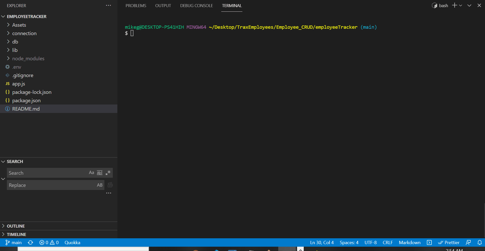
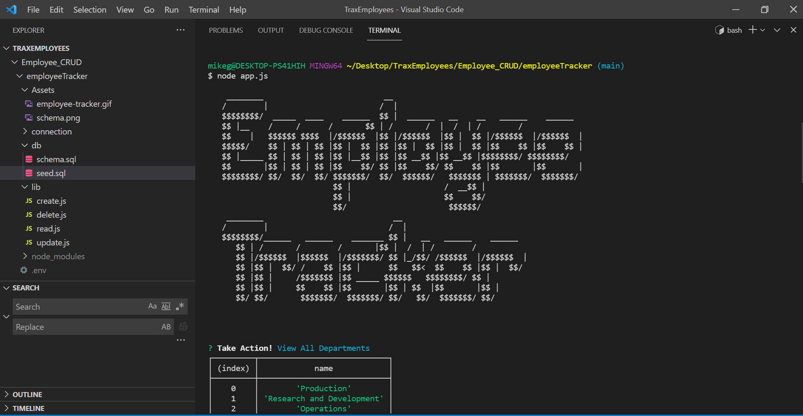

# Employee CRUD

        
## Name:Mike Gordillo
## GitHub user name: https://github.com/MikeGordillo

## Table of contents:  
* [Description](#description)
* [Installation](#Installation)
* [Usage](#usage)
* [License](#license)
* [Testing](#testing)
* [Questions](#questions)
        
## Description:
* creates, reads, updates and deletes an employee database
## Installation:
* must have nodejs installed on your machine for this command line app to work
## Usage:
* 
## license:
* None
        
## Contributing:
* n/a
## Testing:
n/a
* 
## Questions:
* Contact Mike Gordillo with any questions at mikegordillotattoo@gmail.com

https://github.com/MikeGordillo/Employee_CRUD

      